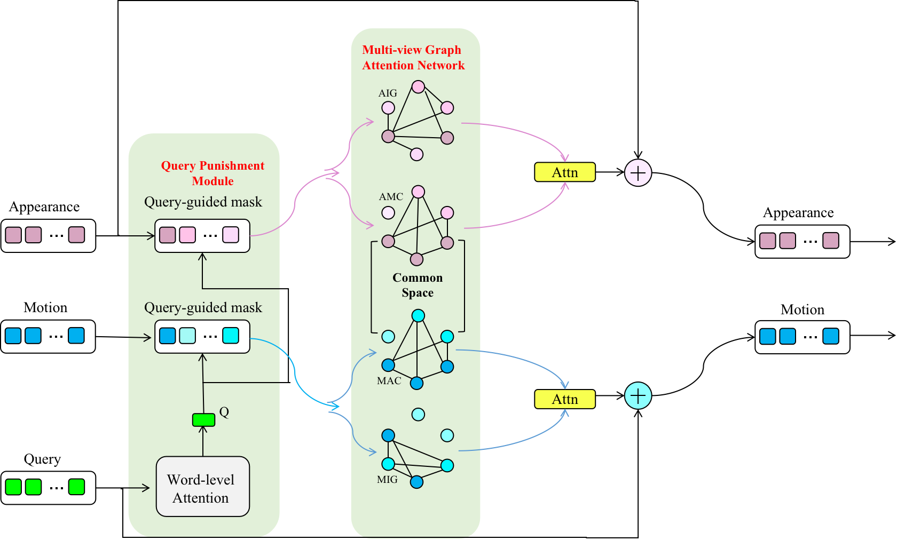
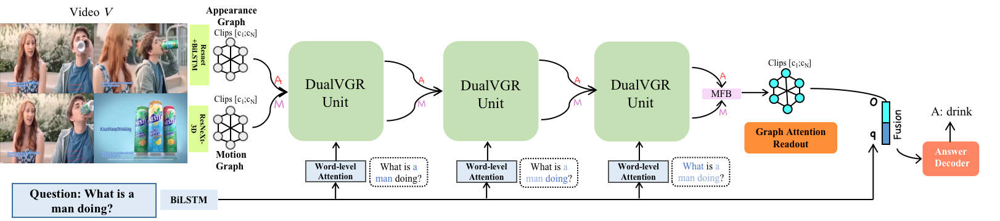
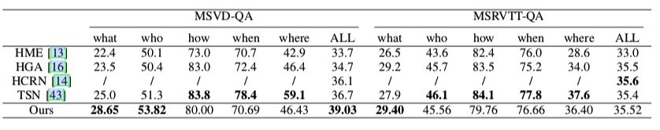
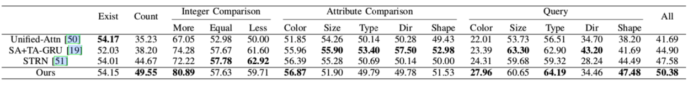

# DualVGR: A Dual-Visual Graph Reasoning Unit for Video Question Answering (DualVGR-VideoQA)
We propose a Dual-Visual Graph Reasoning Unit (DualVGR) which reasons over videos in an end-to-end fashion. The first contribution of our DualVGR is the design of an explainable Query Punishment Module, which can filter out irrelevant visual features through mutiple cycles of reasoning. The second contribution is the proposed Video-based Multi-view Graph Attention Network, which captures the relations between appearance and motion features.

Illustrations of DualVGR unit and the whole framework of our DualVGR Network for VideoQA:

DualVGR Unit             |  DualVGR Architecture
:-------------------------:|:-------------------------:
  |  

## Dataset
-Download [SVQA](https://github.com/SVQA-founder/SVQA), [MSRVTT-QA, MSVD-QA](https://github.com/xudejing/video-question-answering) dataset and edit absolute paths in `preprocess/preprocess_features.py` and `preprocess/preprocess_questions.py` upon where you locate your data. What's more, for SVQA dataset, you have to split the datasets according to our [official split](https://github.com/MMIRMagPie/DualVGR-VideoQA/tree/main/SVQA_splits).

## Our Final Performance on each dataset
Comparison with SoTA on MSVD-QA and MSRVTT-QA datasets


Comparison with SoTA on SVQA dataset


## Preprocessing input features
Be careful to set your feature file path correctly! The following is to run experiments with SVQA dataset, replace `svqa` with `msvd-qa` or `msrvtt-qa` to run with other datasets.

1. To extract appearance features:
```
python preprocess/preprocess_features.py --gpu_id 0 --dataset svqa --model resnet101 --num_clips {num_clips}
```
2. To extract motion features:

-Download ResNeXt-101 [pretrained model](https://drive.google.com/drive/folders/1zvl89AgFAApbH0At-gMuZSeQB_LpNP-M) (resnext-101-kinetics.pth) and place it to `data/preprocess/pretrained/`.
```
python preprocess/preprocess_features.py --dataset svqa --model resnext101 --image_height 112 --image_width 112 --num_clips {num_clips}
```
3. To extract textual features:

-Download [glove pretrained 300d word vectors](http://nlp.stanford.edu/data/glove.840B.300d.zip) to `data/glove/` and process it into a pickle file:
```
 python txt2pickle.py
```
-Process questions:
```
python preprocess/preprocess_questions.py --dataset msrvtt-qa --glove_pt data/glove/glove.840.300d.pkl --mode train
    
python preprocess/preprocess_questions.py --dataset msrvtt-qa --mode val
    
python preprocess/preprocess_questions.py --dataset msrvtt-qa --mode test
```

## Training
```bash
python train.py --cfg configs/svqa_DualVGR_20.yml --alpha {alpha} --beta {beta} --unit_layers {unit_layers}
```

## Evaluation
First, you have to set the correct file path. Then, to evaluate the trained model, run the following:
```bash
python validate.py --cfg configs/svqa_DualVGR_20.yml --unit_layers {unit_layers}
```

## Acknowledgement
Our implementation is based on this [repo](https://github.com/thaolmk54/hcrn-videoqa).
